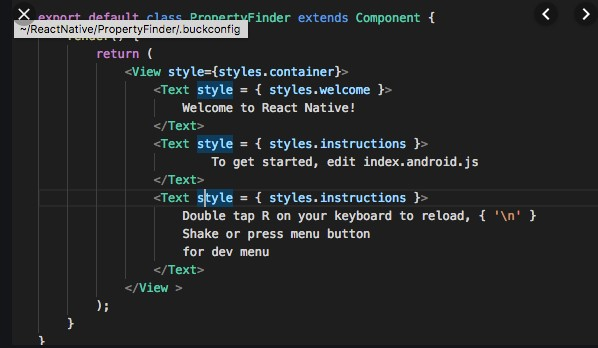

# Aula 1

[Requisitos](../requisitos.md)

## Arquitetura


----

## Revisão da linguagem de programação JavaScript

- Conhecendo um pouco sobre JavaScript
- Palavras Reservadas
- Objetos, Propriedades e Métodos
- Regras de Ouro (EcmaScript 6)
- Funções
- Operadores / Operadores Lógicos
- Comparação
- Condição Ternária
- Callbacks
- Promises
- Promises com async/await

### Funções

> São muito utilizadas no dia dia, vamos dar alguns exemplos de declarações de funções.

```javascript
console.log('oii'); // oii
```

> Exemplos: ES5

```javascript
var x = function(x, y) {
     return x * y;
}
```

```javascript
function x(a, b) {
    return a * b;
}
```

> Exemplo: ES6 | Arrow Functions

```javascript
const x = (x, y) => x * y;
```

```javascript
function myFunction(x, y = 10) {
    // y é por default
    return x + y;
}
myFunction(5); // 15
```

## String

```javascript
const hello = "hello, world";

hello.replace("hello", "goodbye"); // goodbye, world

"hello".toUpperCase(); // HELLO

```

## Objetos

> Exemplo: Aqui podemos criar objetos (entidades)

```javascript
const pessoa = {
  nome: 'Jorge',
  idade: 28,
  cargo: 'Desenvolvedor'
};
console.log(pessoa.nome); // Jorge
```

## Comparação

> Exemplo: Aqui comparamos se a idade é menor que 18

```javascript
const age = 18;
if (age < 18) {
    return "Jovem";
} else {
    return "Adulto";
}
```

## Condição Ternária

> Exemplo: Fazemos o mesmo utilizando apenas uma linha

```javascript
const age = 18;
const pessoa = (age < 18) ? "Jovem": "Adulto";
```

## Rest Params

> Exemplo: Podemos passar vários argumentos

```javascript
function(a, b, ...args) {
  // .console.log(a) = ?
  // .console.log(b) = ?
  // .console.log(args) = [];
}
```

## Destruct

> Você pode quebrar um objeto, separando seus atributos.

```javascript
const pessoa = {
  nome: 'Jorge',
  idade: 28,
  cargo: 'Desenvolvedor'
};

const { nome, idade, cargo } = pessoa;
console.log(nome); // Jorge
console.log(idade); // 28
console.log(cargo); // Desenvolvedor


const { nome, ...rest } = pessoa;
console.log(nome); // Jorge
console.log(rest.idade); // 28
console.log(rest.cargo); // Desenvolvedor
---

const numeros = [1,2,3];
const [a, b, c] = numeros;
console.log(a, b, c) // 1, 2, 3


const numeros = [1,2,3];
const [a, ...rest] = numeros;
console.log(a, b, c) // a, [2,3]

```

## CallBack

```javascript

(() => {
    console.log('exemplo de callback');

    getLista(5, (err, result) => {
        if (err) {
            console.error(err);
            return;
        }

        console.log(result);
    })

})();

function getLista(qtd, callback) {
    const lista = [];

    for (let i = 0; i < qtd; i++) {
        lista.push(i);
    }

    if (lista.length > 5) {
        return callback(new Error('limite excedido de lista'), null);
    }

    return callback(null, lista);
}
```

## Promise

```javascript
(() => {
    console.log('exemplo de promise');

    getLista(5)
        .then((result) => {
            return console.log(result);
        })
        .catch((err) => {
            return console.error(err);
        })

})();

function getLista(qtd) {
    return new Promise((resolve, reject) => {
        const lista = [];

        for (let i = 0; i < qtd; i++) {
            lista.push(i);
        }

        if (lista.length > 5) {
            return reject(new Error('limite excedido de lista'));
        }

        return resolve(lista);
    })
}
```

## Async

```javascript
(async () => {
    console.log('exemplo de async await');

    let promises = [];

    promises.push(getLista(2));
    promises.push(getLista(5));

    const all = await Promise.all(promises);

    try {
        const result = await getLista(5);
        console.log(result);
    } catch (error) {
        console.error(error);
    }
})();

async function getLista(qtd) {
    const lista = [];

    for (let i = 0; i < qtd; i++) {
        lista.push(i);
    }

    if (lista.length > 5) {
        throw new Error('limite excedido de lista');
    }

    return lista;
}
```

----

## JSX

> Esta sintaxe estranha de tags não é uma string, nem HTML.

É chamada JSX e é uma extensão de sintaxe para JavaScript. Recomendamos usar JSX com o React para descrever como a UI deveria parecer. JSX pode lembrar uma linguagem de template, mas que vem com todo o poder do JavaScript.



<https://pt-br.reactjs.org/docs/introducing-jsx.html>

## Criando primeiro APP

<https://expo.io>

[Voltar](../readme.md)
