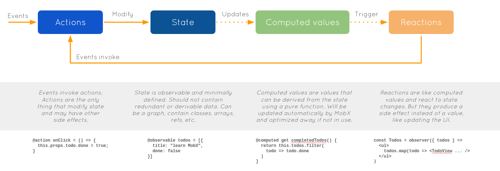

# Aula 2

## App Gasolina ou Alcool'?'

> Revisão de como ficou o app ao-vivo

## Links úteis

* <https://github.com/juninmd/typescript-unifacef>
* <https://github.com/juninmd/etanol-gasolina>
* <https://github.com/jondot/awesome-react-native>
* <https://github.com/topics/typescript>
* <https://github.com/topics/react-native>

## Instalando Yarn

```bash
  npm i -g yarn
```

ou

<https://classic.yarnpkg.com/pt-BR/docs/install/#windows-stable>

ou

```bash
choco install yarn
````

## Conhecendo TypeScript

- O que é TypeScript? <https://www.typescriptlang.org/docs/handbook/typescript-in-5-minutes.html>

- Documentação Oficial <https://www.typescriptlang.org/>

- Compilando

```bash
npm install -g typescript
```

```bash
tsc arquivo.ts
```

```bash
yarn add --dev ts-node
```

- TsConfig

## Quem usa TypeScript'?'

- Slack <https://slack.engineering/typescript-at-slack-a81307fa288d>

- Google <https://github.com/google/gts>

## Criando APP em TypeScript

Iniciamos um projeto novo

```bash
npx react-native init gasolina
```

<https://facebook.github.io/react-native/docs/typescript>

```bash
yarn add --dev typescript @types/jest @types/react @types/react-native @types/react-test-renderer
```

criar aquivo tsconfig.json

```json
{
    "compilerOptions": {
        "incremental": true,
        "target": "es5",
        "moduleResolution": "node",
        "experimentalDecorators": true,
        "emitDecoratorMetadata": true,
        "preserveConstEnums": true,
        "pretty": true,
        "lib": [
            "dom",
            "dom.iterable",
            "esnext"
        ],
        "module": "esnext",
        "forceConsistentCasingInFileNames": true,
        "allowJs": true,
        "checkJs": true,
        "sourceMap": true,
        "strict": true,
        "typeRoots": [
            "./node_modules/@types"
        ],
        "skipLibCheck": true,
        "jsx": "preserve",
        "rootDir": "src",
        "noImplicitReturns": true,
        "noImplicitThis": true,
        "noImplicitAny": false,
        "strictNullChecks": true,
        "suppressImplicitAnyIndexErrors": true,
        "noUnusedLocals": true,
        "esModuleInterop": true,
        "allowSyntheticDefaultImports": true,
        "resolveJsonModule": true,
        "isolatedModules": true,
        "noEmit": true
    },
    "include": [
        "src",
        "src/__tests__"
    ],
    "exclude": [
        "node_modules",
        "babel.config.js",
        "metro.config.js",
        "jest.config.js"
    ],
    "typeRoots": [
        "./typings"
    ],
}
```

criar pasta typings
adicionar arquivo json.d.ts

```ts
declare module "*.json" {
    const value: any;
    export default value;
}
```

renomear os seguintes arquivos .js [index.js e app.js] para .tsx

## Instalando Mobx

```bash
yarn add mobx mobx-react
```

## Instalando React Navigation

```bash
yarn add @react-navigation/native @react-navigation/stack babel-plugin-transform-decorators-legacy react-native-safe-area-context react-native-gesture-handler @react-native-community/masked-view react-native-reanimated react-native-screens
```

add no topo do arquivo do index.tsx

```js
import 'react-native-gesture-handler';
```

Adicione o plugin do babel `babel.config.js`


```diff
module.exports = {
  presets: ['module:metro-react-native-babel-preset'],
+  "plugins": [
+    [
+      "@babel/plugin-proposal-decorators",
+      {
+        "legacy": true
+      }
+    ]
+  ]
};
```

> na raiz do projeto
criar pasta ´src´

> dentro de `src`
criar pastas

```text
containers
routes
stores
```

> dentro de `stores`
criar arquivo home.store.tsx

```ts
import { action, observable } from 'mobx';

export default class HomeStore {
    @observable numbers = 0;

    @action reset = () => {
        this.numbers = 0;
    }

    @action increment = () => {
        this.numbers += 1;
    }

}
const homeStore = new HomeStore();
export { homeStore };
```

> dentro de stores
crie o arquivo index.tsx

```ts
import { homeStore } from './home.store';

export {
    homeStore
}  
```

> dentro de routes
criar arquivo index.tsx

```tsx
import * as React from 'react';

import Home from '../containers/home';
import { NavigationContainer } from '@react-navigation/native';
import { createStackNavigator } from '@react-navigation/stack';

const Stack = createStackNavigator();

function Routes() {
    return (
        <NavigationContainer>
            <Stack.Navigator>
                <Stack.Screen options={{
                    headerTitle: 'Etanol ou Gasolina?',
                    headerTintColor: '#ffffff',
                    headerStyle: {
                        backgroundColor: '#2b7cd7',
                    }
                }} name="Home" component={Home} />
            </Stack.Navigator>
        </NavigationContainer>
    );
}
export default Routes;
```

> dentro de home
criar arquivo index.tsx

```tsx
import React, { Component } from 'react';
import { Text, View } from 'react-native';
import { inject, observer } from 'mobx-react';

import HomeStore from '../../stores/home.store';

interface Props {
    homeStore: HomeStore
}

@inject('homeStore')
@observer
export default class Home extends Component<Props> {
    render() {
        return (<>
            <View style={{ flex: 1, alignItems: 'center', justifyContent: 'center' }}>
                <Text>Home Screen</Text>
                <Text>{this.props.homeStore.numbers}</Text>
            </View>
        </>);
    }
}
```


## Mobx

* LifeCycle


