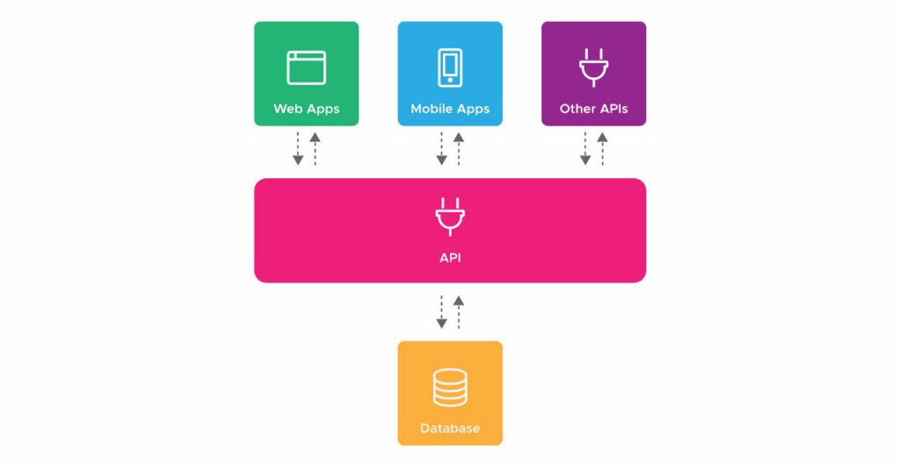
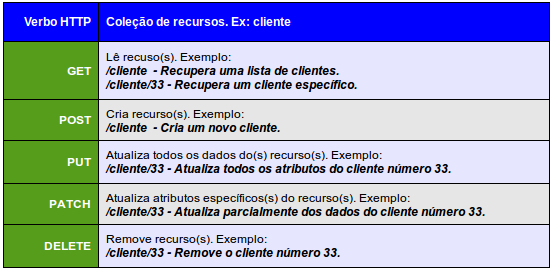
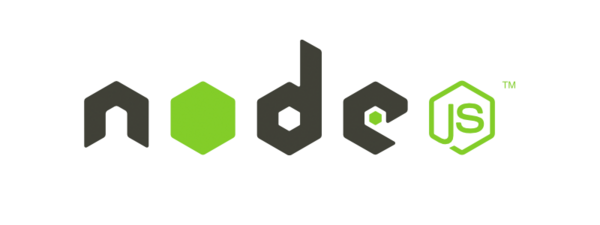
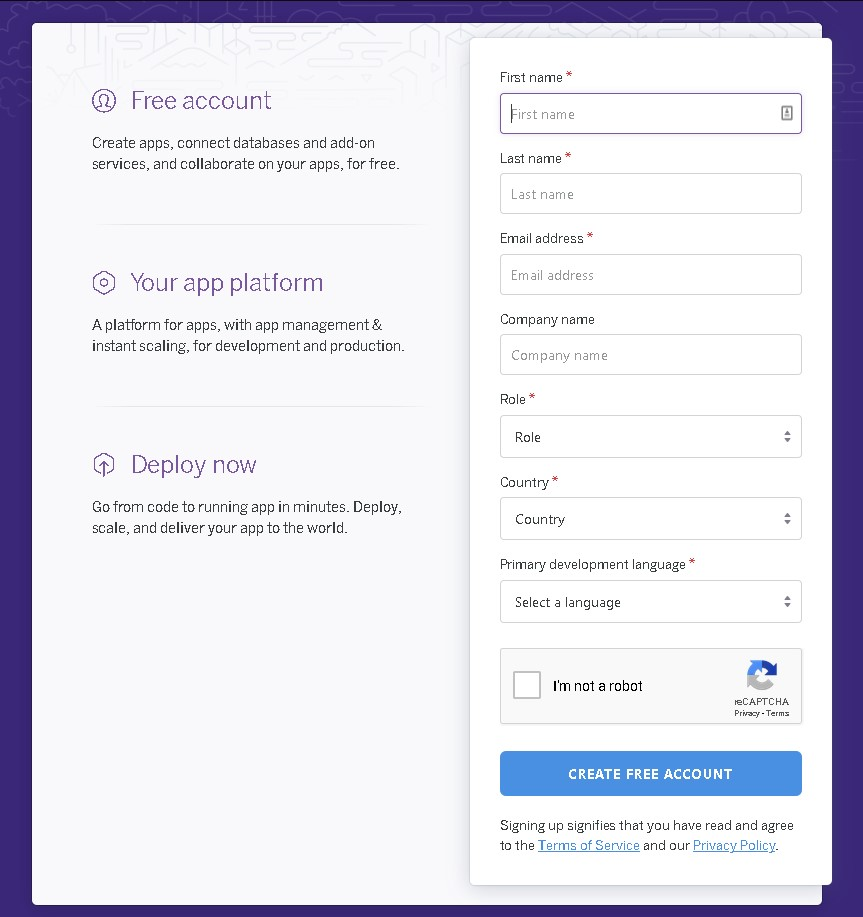
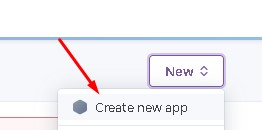
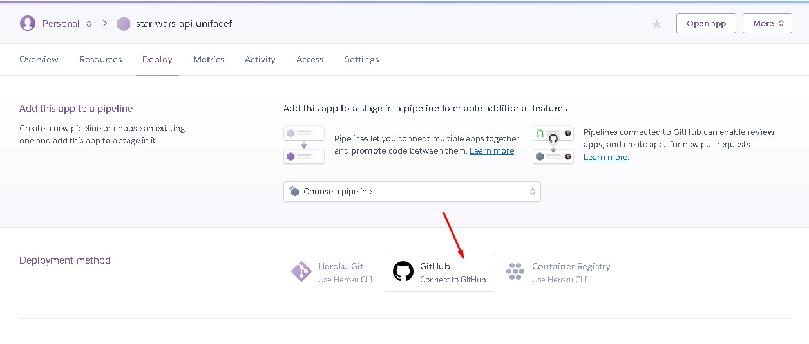
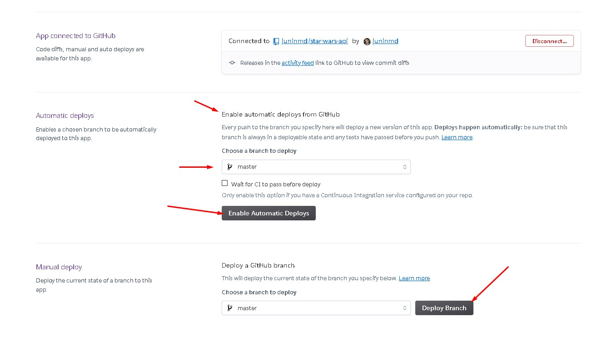
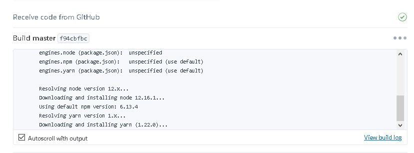
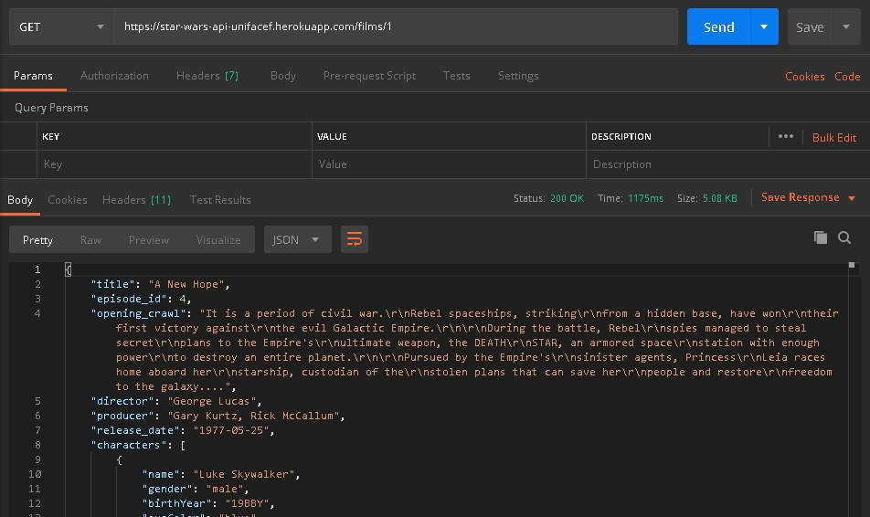

# Aula 3

## Links Úteis

<https://chrome.google.com/webstore/detail/json-formatter/bcjindcccaagfpapjjmafapmmgkkhgoa?hl=pt-BR>

## APIS



A sigla API corresponde às palavras em inglês “Application Programming Interface“. No português “Interface de Programação de Aplicações”.

Elas são uma forma de integrar sistemas, possibilitando benefícios como a segurança dos dados, facilidade no intercâmbio entre informações com diferentes linguagens de programação e a monetização de acessos.

As APIs são um tipo de “ponte” que conectam aplicações, podendo ser utilizadas para os mais variados tipos de negócio, por empresas de diversos nichos de mercado ou tamanho.


## Rest-Full

REST significa `Representational State Transfer`. Em português, Transferência de Estado Representacional. 

Trata-se de uma abstração da arquitetura da Web. 

Resumidamente, o REST consiste em princípios/regras/constraints que, quando seguidas, permitem a criação de um projeto com interfaces bem definidas. Desta forma, permitindo, por exemplo, que aplicações se comuniquem.

Existe uma certa confusão quanto aos termos REST e RESTful. Entretanto, ambos representam os mesmo princípios. A diferença é apenas gramatical. Em outras palavras, sistemas que utilizam os princípios REST são chamados de RESTful.


REST: conjunto de princípios de arquitetura
RESTful: capacidade de determinado sistema aplicar os princípios de REST

> Esse padrão é muito utilizado para a criação de Apis, lembre-se que todo Web-Service é uma Api, mas nem toda Api é um web service.





---

## Axios


Há diversos momentos quando você está desenvolvendo uma aplicação Web que podem necessitar consumir e exibir dados de uma API. Há várias maneiras de se fazer isso, mas a maneira mais popular é usando axios, um cliente HTTP baseado em Promises.
Temos várias maneiras de recuperarmos informações de uma API, mas primeiro é interessante descobrir o formato dos dados, para sabermos o que mostraremos. Para fazer isso, faremos uma requisição para o endpoint da API, para podermos ver os dados.

Axios é um cliente HTTP, que funciona tanto no browser quanto em node.js. A biblioteca é basicamente uma API que sabe interagir tanto com XMLHttpRequest quanto com a interface http do node. Isso significa que o mesmo código utilizado para fazer requisições ajax no browser também funciona no servidor. Além disso, as requisições feitas através da biblioteca retornam uma promise, compatível com a nova versão do JavaScript - ES6.

Para instalar o axios é bem simples, você pode usar os seguintes comandos.

```bash
yarn add axios
yarn add --dev @types/axios // caso seja typescript
```

Exemplo de chamada axios em JavaScript 

```js
axios.get('https://api.github.com/users/' + username)
  .then(function(response){
    console.log(response.data); // ex.: { user: 'Your User'}
    console.log(response.status); // ex.: 200
  });
```

Caso prefira uma versão Gourmet

```js
try {
  const { data, status } = await axios.get(`https://api.github.com/users/${username}`);
  console.log(data);
  console.log(status);
} catch (error) {
    console.error(error);
  throw error;
}
```

> Vamos utilizar o playground para brincar com o Axios e entender ele melhor

[Playground Typescript Unifacef](https://github.com/juninmd/typescript-unifacef)

## Android 

> Detalhe Importante

Por padrão nas versões mais atualizadas do android, não é aceito requisições feitas em http:// apenas https://

## Criando uma API em Node com Express + deploy via Heroku




Vamos criar uma API simples para consumir a Api do Star Wars


## Express 


### Star Wars API
> Antes de desenvolvermos, vamos dar uma olhadinha na documentação da API

[Link da Documentação](https://swapi.co/documentation)

### Passo a Passo
* Crie um repositório no GitHub
* Clone em seu computador
* Digite o seguinte comando para inicializar as dependencias do npm:
  ```
  npm init
  ```
  Confirme os dados com o `y` ao fim.
* No arquivo `package.json` adicione a seguinte linha dentro do atributos `scripts`
  ```
  "start": "node index.js",
  ```
* Rode o seguinte comando para adicionar as dependências:
  ```
  yarn add express axios
  ```
  Isso irá adicionar as dependências do Axios e do Express ao seu projeto.
* Crie um arquivo chamado `Procfile` e adicione o seguinte conteúdo
  ```
  web: npm start
  ```
  Esse arquivo indicará ao Heroku qual será o tipo de aplicação e qual comando ele deve executar para rodar sua aplicação.
* Crie um arquivo `index.js` com o cabeçalho da sua API

  ```js
  const app = require('express')();
  const axios = require('axios');

  app.use((req, res, next) => {
    res.header('Content-Type', 'application/json; charset=utf-8');
    res.header('Access-Control-Allow-Origin', '*');
    res.header('Access-Control-Allow-Headers', req.header('access-control-request-headers' || '*'));
    res.header('Access-Control-Allow-Methods', 'GET,POST,PUT,DELETE,OPTIONS');

    if (req.method === 'OPTIONS') {
      return res.status(204).send();
    }
    next();
  });
  ```
  Isso habilitará o `cors` da sua API e instancia as libs necessárias do projeto.

* Adicione uma constante com o BaseURL da API do Star Wars
  ```js
  const baseURL = 'https://swapi.co/api/';
  ```
* Adicione essa função que será útil para nosso projeto
  ```js
  const getFilmId = (url) => {
    const id = url.split('/')[5];
    return Number(id);
  }
  ```
  Com ela vamos obter os ids dos filmes

* Adicione essa outra função que também será útil para nosso projeto
  ```js
  const getCharacterImageUrl = (url) => {
    const getCharacterId = url.split('/')[5];
    return `https://starwars-visualguide.com/assets/img/characters/${getCharacterId}.jpg`;
  }
  ```
  Com ela vamos obter as fotos dos personagens

* Adicione essa função para obter imagem dos filmes
  ```js
  const getFilmImageUrl = (id) => {
    return `https://starwars-visualguide.com/assets/img/films/${id}.jpg`;
  }
  ```
  Com ela vamos obter as fotos dos personagens

* Vamos adicionar nossa primeira rota para obtermos os filmes
  ```js
  app.get('/films', async (req, res, next) => {
    try {
      const { data: { results } } = await axios.request({ baseURL, url: 'films' });
      results.forEach(x => x.id = getFilmId(x.url));
      return res.send(results).status(200);
    } catch (error) {
      console.error(error);
      next(error);
    }
  });
  ```

* Vamos adicionar nossa primeira rota para obtermos apenas um filme pelo ID
  ```js
  app.get('/films/:id', async (req, res, next) => {
    try {
      const filmId = req.params.id;
      const { data } = await axios.request({ baseURL, url: `films/${filmId}` });

      const charactersRequests = await Promise.all(data.characters.map(characterUrl => {
        return axios.get(characterUrl);
      }));

      const characters = charactersRequests.map((y) => y.data).map((x) => {
        return {
          name: x.name,
          gender: x.gender,
          birthYear: x.birth_year,
          eyeColor: x.eye_color,
          height: x.height,
          mass: x.mass,
          photo: getCharacterImageUrl(x.url)
        }
      });

      data.id = getFilmId(data.url);
      data.photo = getFilmImageUrl(data.id);
      data.characters = characters;

      return res.send(data).status(200);
    } catch (error) {
      console.error(error);
      next(error);
    }
  });
  ```
* Vamos adicionar uma rota padrão caso o usuário informe alguma outra url
  ```js
  app.all('*', async (req, res, next) => {
    res.send({
      routes: ['films', 'films/id']
    })
  })
  ```
* Agora para finalizar incluímos a porta onde nossa API será exposta
  ```js
  const port = process.env.PORT || 9000;
  app.listen(port, () => {
    console.log(`Aplicação - Ativa :D | ${port}`);
  });
  ```
* Remova a `node_modules` do git, crie um arquivo `.gitignore` com o seguinte conteúdo:
  ```
  node_modules/
  ```
  ou digite no terminal parar gerar o arquivo
  ```
  npx gign .
  ```
* Caso você já tenha dado push na `node_modules`, digite o seguinte comando:
  ```
    git rm -r node_modules
    git commit -m 'removendo node_modules'
    git push origin master
  ```

* Finalizamos o código! Agora é a hora do Deploy :)

> Não esqueça de fazer `commit` e `push`!

Código final está disponível em: <https://github.com/juninmd/star-wars-api.git>

## Heroku 

Acesse o Site do [Heroku](https://www.heroku.com/) 


> Clique em [SIGN UP FOR FREE]


> Informe seus dados pessoais (vamos utilizar o serviço gratuito) 


> Crie um novo APP


> Escolhe um nome único para o seu APP


> Adicione a integração ao Github


> Procure pelo seu repositório (recentemente criado)


> Habilite [ENABLE AUTOMATE DEPLOYS] para que seu app seja atualizado na internet conforme seu código sobe para a branch selecionada para o deploy, por padrão ela é a `master`, depois logo em baixo clique em [DEPLOY BRANCH] para fazer sua primeira publicação.


> Após o clique, você irá notar que será realizada a instalação de dependencias se seu projeto irá subir.


> Clique no botão [VIEW] para testar sua aplicação.

<https://star-wars-api-unifacef.herokuapp.com>

## Postman


O Postman é um API Client que facilita aos desenvolvedores criar, compartilhar, testar e documentar APIs. Isso é feito, permitindo aos usuários criar e salvar solicitações HTTP e HTTPs simples e complexas, bem como ler suas respostas.

Podemos visualizar aqui o retorno da API.


---

E agora vamos ao React Native...

Crie um novo repositório no github chamado `star-wars-app`, clone na sua máquina, para ganharmos tempo, copie o projeto do `etanol ou gasolina` para a nova pasta gerada do seu clone com todas as pastas, exceto a `node_modules` e a `.git`.

O Aplicativo final estará disponível em: <https://github.com/juninmd/star-wars-app>

## O Aplicativo

Vamos pegar nosso projeto já copiado e adicionar a lib do `axios`

```bash
yarn add axios
```

Adicione o enum no arquivo index.tsx antes das Rotas

```ts
export enum ROUTES_NAMES {
    Home = "Home",
    Film = "Film"
}
```

Altere o headerTitle para 'StarWars'
```
 headerTitle: 'Star Wars',
```

Altere o background color para 'black'
```
  headerStyle: {
      backgroundColor: 'black',
  }
```

Altere o StackNavigator para

```ts
Stack.Navigator initialRouteName={ROUTES_NAMES.Home}
```

crie uma pasta chamada `apis`, dentro dela crie um arquivo chamado `star-wars.api.ts` com o seguinte conteúdo:

```ts
import axios from 'axios';

const baseURL = 'https://star-wars-api-unifacef.herokuapp.com';

export const getFilms = async () => {
    return axios.request({
        baseURL,
        url: 'films'
    })
}

export const getFilmById = async (id: number) => {
    return axios.request({
        baseURL,
        url: `films/${id}`
    })
}
```

Crie uma pasta chamada `interfaces` dentro da pasta `src`, dentro dela crie um arquivo chamado `star-wars.interface.ts` com o seguinte conteúdo:

```ts
export interface Character {
    name: string;
    gender: string;
    birthYear: string;
    eyeColor: string;
    height: string;
    mass: string;
    photo: string;
}

export interface Film {
    title: string;
    id: number;
    episode_id: number;
    opening_crawl: string;
    photo: string;
    director: string;
    producer: string;
    release_date: string;
    characters: Character[];
    planets: string[];
    starships: string[];
    vehicles: string[];
    species: string[];
    created: Date;
    edited: Date;
    url: string;
}
```

Agora acesse o `home.store.tsx` apague todo o código e deixe da seguinte forma:

```ts
import * as starWarsApi from '../apis/star-wars.api'

import { action, observable } from 'mobx';

import { Film } from '../interfaces/star-wars.interface';

export default class HomeStore {

  @observable films: Film[] = [];
  @observable film: Film | any = {};

  @action getFilms = async () => {
    try {
      const { data: films } = await starWarsApi.getFilms();
      this.films = films;
    } catch (error) {
      this.films = [];
    }
  }

  @action getFilmById = async (id: number) => {
    try {
      this.film = {};
      const { data: film } = await starWarsApi.getFilmById(id);
      this.film = film;
    } catch (error) {
      this.film = {};
    }
  }

}
const homeStore = new HomeStore();
export { homeStore };
```

Atualize o arquivo dentro de containers/home `index.tsx` para ficar:

```tsx
import { Card, Layout, Text } from '@ui-kitten/components';
import React, { Component, } from 'react';
import { inject, observer } from 'mobx-react';

import HomeStore from '../../stores/home.store';
import { ROUTES_NAMES } from '../../routes';
import { ScrollView } from 'react-native-gesture-handler';
import { StyleSheet } from 'react-native';

interface Props {
  homeStore: HomeStore,
  navigation: any
}

@inject('homeStore')
@observer
export default class Home extends Component<Props> {

  async componentDidMount() {
    const { getFilms } = this.props.homeStore;
    await getFilms();
  }

  render() {
    const { films } = this.props.homeStore;

    const navigateScreen = (id: number) => {
      const { navigate } = this.props.navigation;
      navigate(ROUTES_NAMES.Home, { id });
    }

    return (<Layout style={{ flex: 1, backgroundColor: 'black' }}>
      <ScrollView>
        {films.map((film, index) => (
          <Card onPress={() => navigateScreen(film.id)} key={index}>
            <Text style={styles.title}>{film.title}</Text>
            <Text>Episode {film.episode_id.toString()}</Text>
          </Card>
        ))}
      </ScrollView>
    </Layout>);
  }
}

const styles = StyleSheet.create({
  container: {
    flex: 1,
    justifyContent: 'center',
    paddingTop: '10',
    padding: 8,
  },
  title: {
    fontSize: 20,
  },
  paragraph: {
    margin: 24,
    fontSize: 18,
    fontWeight: 'bold',
    textAlign: 'center',
  },
});
```

Após isso, crie uma pasta chamada `film` dentro de containers, crie um arquivo `index.tsx` dentro dessa pasta e após isso coloque o seguinte conteúdo:

```tsx
import { Card, Layout, Spinner, Text } from '@ui-kitten/components';
import { Image, ScrollView, StyleSheet } from 'react-native';
import React, { Component } from 'react';
import { inject, observer } from 'mobx-react';

import HomeStore from '../../stores/home.store';
import { getFilms } from '../../apis/star-wars.api';

interface Props {
 homeStore: HomeStore;
 navigation: any;
 route: any;
}

@inject('homeStore')
@observer
export default class Film extends Component<Props> {

 async componentDidMount() {
  const { params } = this.props.route;
  const { getFilmById } = this.props.homeStore;
  await getFilmById(params.id);
 }

 render() {
  const { film } = this.props.homeStore;

  return (<Layout style={{ flex: 1, backgroundColor: 'black' }}>
   <ScrollView>

    {!film.episode_id && <Card><Text>Carregando...<Spinner /></Text></Card>}

    {film.episode_id &&
     <Card status='success'>
      <Image source={{ uri: film.photo }}
       style={{ width: 200, height: 200 }} />
      <Text style={styles.title}>{film.title}</Text>
      <Text>{film.opening_crawl}</Text>
      <Text>Director: {film.director}</Text>
      <Text>Producer: {film.producer}</Text>
      <Text>Release Date: {film.release_date}</Text>
     </Card>
    }

    {film.characters && <Card><Text>Personagens</Text></Card>}

    {film && film.characters && film.characters.map((character, k) => (
     <Card key={k} status='success'>
      <Image source={{ uri: character.photo }}
       style={{ width: 100, height: 100 }} />
      <Text>{character.name}</Text>
      <Text>Gender: {character.gender}</Text>
      <Text>Mass: {character.mass}</Text>
     </Card>
    ))}
   </ScrollView>
  </Layout>)
 }
}

const styles = StyleSheet.create({
 scrollView: {
  backgroundColor: 'black',
  color: 'white',
  marginHorizontal: 20,
 },
 title: {
  fontSize: 20,
 },
});
```

Adicione uma nova rota ao projeto, no arquivo `routes/index.tsx` :

```tsx
import Film from '../containers/film';
```
> adicione esse bloco dentro do bloco `<Stack.Navigator initialRouteName={ROUTES_NAMES.Home}>`
```tsx
  <Stack.Screen options={{
      headerTitle: 'Detail of Movie',
      headerTintColor: '#ffffff',
      headerStyle: {
        backgroundColor: 'black',
      }
    }} name={ROUTES_NAMES.Film} component={Film} />
```